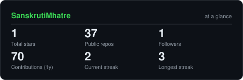
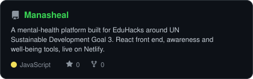
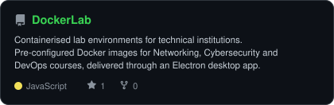
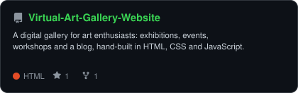
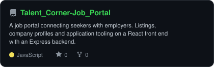

<div align="center">

<!-- PORTRAIT - generated by scripts/dotify.py from assets/jacket.png.
     Colour mode, so one file serves both GitHub themes. Regenerate with:
       python scripts/dotify.py assets/jacket.png -o assets/portrait \
         --cols 150 --equalize --detail 0.5 --color -->


<br>

<!-- NAME / TAGLINE - animated typing -->
<a href="https://github.com/SanskrutiMhatre">
  
</a>

<br>

<!-- SOCIALS -->

<a href="https://linkedin.com/in/sanskrutimhatre"></a>
<a href="mailto:mhatresanskruti42@gmail.com"></a>
<a href="https://portfolio-sanskruti-mhatres-projects.vercel.app"></a>
<a href="https://www.geeksforgeeks.org/user/sanskruti_mhatre"></a>
<a href="https://leetcode.com/u/sanskruti_mhatre"></a>


</div>

---

## `~/` whoami

```console
$ cat about.txt
```

Hi, I'm **Sanskruti Mhatre**. I build for the web:- frontend first, backend when it needs one and I keep wandering into machine learning whenever a problem looks like it wants a model.

- Currently building **[DEVELOPMENT-STANDARDIZATION](https://github.com/SanskrutiMhatre/DEVELOPMENT-STANDARDIZATION)** and **[Manasheal](https://github.com/SanskrutiMhatre/Manasheal)**
- Portfolio: **[portfolio-sanskruti-mhatres-projects.vercel.app](https://portfolio-sanskruti-mhatres-projects.vercel.app)**
- Based in **Mumbai, Maharashtra**
- Fun fact: **Eager to learn and explore in the world of software development, let's connect and build something.**

<br>

<div align="center">

## `~/` toolbox


</div>

---

<div align="center">

## `~/` skill radar

<table>
<tr>
<td width="50%" align="center" valign="middle">

<!-- Self-rated radar - edit assets/skills.json, the workflow redraws it -->
<picture>
  <source media="(prefers-color-scheme: dark)"  srcset="assets/radar-dark.svg">
  <source media="(prefers-color-scheme: light)" srcset="assets/radar-light.svg">
  
</picture>

</td>
<td width="50%" align="center" valign="middle">

<!-- Live radar built from real language byte counts across your repos -->
<picture>
  <source media="(prefers-color-scheme: dark)"  srcset="assets/radar-langs-dark.svg">
  <source media="(prefers-color-scheme: light)" srcset="assets/radar-langs-light.svg">
  
</picture>

</td>
</tr>
</table>

</div>

---

<div align="center">

## `~/` contribution calendar

<!-- 3D isometric calendar, regenerated every 6h by .github/workflows/metrics.yml -->


<br><br>

<!-- Snake eats the contribution graph - .github/workflows/snake.yml -->
<picture>
  <source media="(prefers-color-scheme: dark)"  srcset="https://raw.githubusercontent.com/SanskrutiMhatre/SanskrutiMhatre/output/snake-dark.svg">
  <source media="(prefers-color-scheme: light)" srcset="https://raw.githubusercontent.com/SanskrutiMhatre/SanskrutiMhatre/output/snake.svg">
  
</picture>

</div>

---

<div align="center">

## `~/` the numbers

<!-- Generated by scripts/cards.py into this repo. Deliberately NOT
     github-readme-stats / streak-stats / github-profile-trophy: those are
     shared public instances that go down and take the whole section with them. -->
<picture>
  <source media="(prefers-color-scheme: dark)"  srcset="assets/card-stats-dark.svg">
  <source media="(prefers-color-scheme: light)" srcset="assets/card-stats-light.svg">
  
</picture>

<br>


</div>

---

<div align="center">

## `~/` selected work

<!-- Cards generated by scripts/cards.py from assets/projects.json.
     Stars, forks and language are pulled live from the API on every run. -->
<table>
<tr>
<td width="50%">
  <a href="https://github.com/SanskrutiMhatre/Manasheal">
    <picture>
      <source media="(prefers-color-scheme: dark)"  srcset="assets/card-Manasheal-dark.svg">
      <source media="(prefers-color-scheme: light)" srcset="assets/card-Manasheal-light.svg">
      
    </picture>
  </a>
</td>
<td width="50%">
  <a href="https://github.com/SanskrutiMhatre/DockerLab">
    <picture>
      <source media="(prefers-color-scheme: dark)"  srcset="assets/card-DockerLab-dark.svg">
      <source media="(prefers-color-scheme: light)" srcset="assets/card-DockerLab-light.svg">
      
    </picture>
  </a>
</td>
</tr>
<tr>
<td width="50%">
  <a href="https://github.com/SanskrutiMhatre/Virtual-Art-Gallery-Website">
    <picture>
      <source media="(prefers-color-scheme: dark)"  srcset="assets/card-Virtual-Art-Gallery-Website-dark.svg">
      <source media="(prefers-color-scheme: light)" srcset="assets/card-Virtual-Art-Gallery-Website-light.svg">
      
    </picture>
  </a>
</td>
<td width="50%">
  <a href="https://github.com/SanskrutiMhatre/Talent_Corner-Job_Portal">
    <picture>
      <source media="(prefers-color-scheme: dark)"  srcset="assets/card-Talent_Corner-Job_Portal-dark.svg">
      <source media="(prefers-color-scheme: light)" srcset="assets/card-Talent_Corner-Job_Portal-light.svg">
      
    </picture>
  </a>
</td>
</tr>
</table>

<sub>

| project                                                                                     | live                                                    | stack                                         |
|---------------------------------------------------------------------------------------------|---------------------------------------------------------|-----------------------------------------------|
| **[Manasheal](https://github.com/SanskrutiMhatre/Manasheal)**                               | [manasheal.netlify.app](https://manasheal.netlify.app/) | `React` `JavaScript`                          |
| **[DockerLab](https://github.com/SanskrutiMhatre/DockerLab)**                               | [dockerhub.nagarji.in](http://dockerhub.nagarji.in/)    | `Docker` `Kubernetes` `Electron` `JavaScript` |
| **[Virtual Art Gallery](https://github.com/SanskrutiMhatre/Virtual-Art-Gallery-Website)**   | —                                                       | `HTML` `CSS` `JavaScript`                     |
| **[Talent Corner Job Portal](https://github.com/SanskrutiMhatre/Talent_Corner-Job_Portal)** | —                                                       | `React` `Express` `Node.js`                   |

</sub>

</div>

---

<div align="center">

<sub>`01110100 01101000 01100001 01101110 01101011 01110011 00100000 01100110 01101111 01110010 00100000 01110011 01100011 01110010 01101111 01101100 01101100 01101001 01101110 01100111`</sub>

</div>
